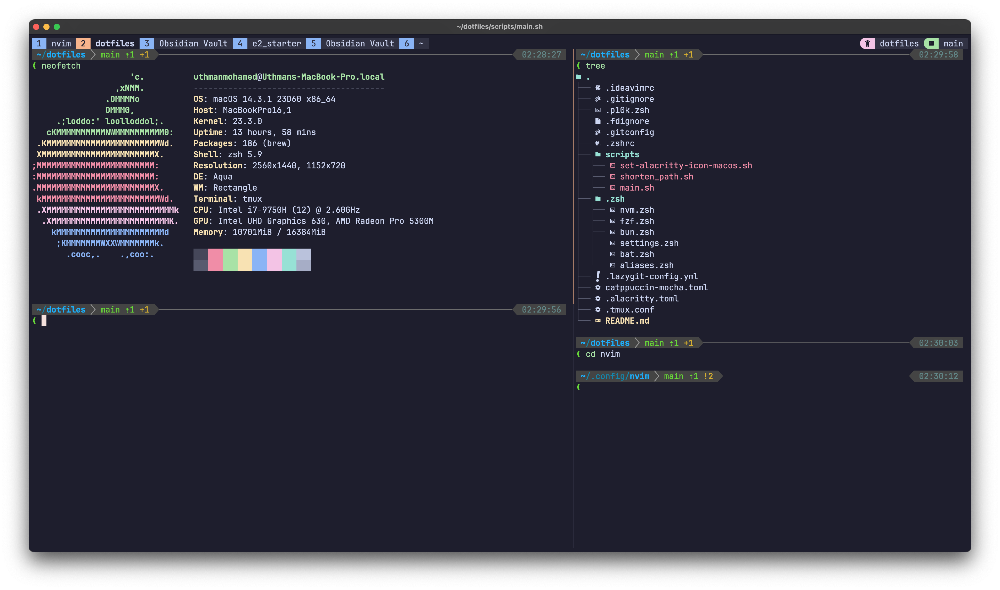

# My Dotfiles

This is a collection of my dotfiles - configuration files for various tools and programs I use, such as `zsh`, `git`, etc.

My terminal setup includes:
- [Alacritty](https://alacritty.org) as my terminal emulator
- [Neovim](https://neovim.io) as my IDE (see my neovim configuration at [github.com/uthmanmoh/nvim](https://github.com/uthmanmoh/nvim))
- [oh-my-zsh](https://ohmyz.sh/) as my shell
- [Tmux](https://github.com/tmux/tmux) as my terminal session manager
- [Catppuccin](https://github.com/catppuccin) as my color scheme for Alacritty, Tmux, and Neovim
- [Powerlevel10k](https://github.com/romkatv/powerlevel10k) as my zsh theme

Here is a preview of my terminal setup:


## How to setup my dotfiles

```bash
cd ~ # start from the home directory
git clone https://github.com/uthmanmoh/dotfiles.git
cd dotfiles
./setup.sh
```

The `setup.sh` script will 
1. Install all of my dependencies using `brew`
2. Symlink all of my dotfiles to their appropriate directories

This script is **idempotent** - i.e. You can run it even if tools are installed or partial dotfiles are setup and it will do nothing.

## CLI Tools I use

Note: You can install all of these tools using `brew` on macOS:

- [fzf](https://github.com/junegunn/fzf) - Fuzzy finder
- [ripgrep](https://github.com/BurntSushi/ripgrep) - Faster `grep`
- [fd](https://github.com/sharkdp/fd) - Faster `find`
- [bat](https://github.com/sharkdp/bat) - Better `cat` with syntax highlighting
- [eza](https://github.com/eza-community/eza) - Better `ls,` specifically for the tree view
- [zoxide](https://github.com/ajeetdsouza/zoxide) - A smarter `cd` command
- [lazygit](https://github.com/jesseduffield/lazygit) - A simple terminal UI for git commands
- [delta](https://github.com/dandavison/delta) - A better git diff (see my `.gitconfig` for how I use it)
- [karabiner](https://github.com/pqrs-org/Karabiner-Elements) - A keyboard customization tool
